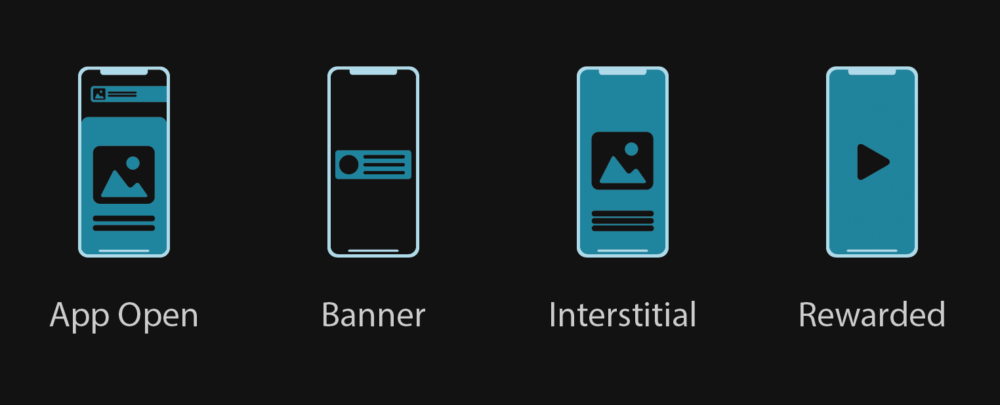

# Ads Pro

> An Unreal Engine plugin to display ads on mobile devices.

## Unreal Engine Marketplace
The plugin can be downloaded from the [Unreal Engine Marketplace](https://www.unrealengine.com/marketplace/en-US/product/003c2267b99c461d833b3664ee5552ee).

## How it works
The plugin uses the Google Mobile Ads SDK (AdMob) of the target platform internally to display native ads. A simple yet complete API is available for both Blueprints
and C++ to seemlessly implement ads with Unreal Engine without bothering about platform-specific details.  
All functionalities are available without limitation for Blueprints and / or C++.

## Features
- Multiple Ad Formats.
- Ad Mediation.
- GDPR support.
- iOS 14 app transparency support.
- Really easy to use.

## Get Started
Start by following the [Get Started](/getstarted) page or dive directly in the code with the [Blueprints Examples](/blueprintexamples).

## Support
The [Troubleshooting](/troubleshooting) and the [Common Issues](/commonissues) pages might help you to quickly find a solution to a problem.  
If you have question(s) about the plugin, visit the [Frequently Asked Questions](/frequentlyaskedquestions).  
If these pages still don't contain what you are looking for, see how to contact us on the [Contact](/contact) page.
 
