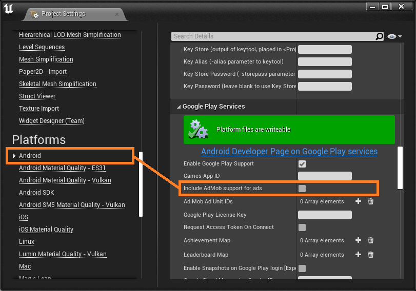

# Common Issues
This section contains common issues.

# Android Build Failed with Error: `cannot find symbol`
The issue occurs because Ads Pro updates the libraries used by Unreal Engine, breaking the deprecated imports.

To solve this issue:
1. Open your project's settings.
2. Click on `Android` under `Platforms` in the left pane.
3. Scroll to the `Google Play Services` category.
4. Untick `Include AdMob support for ads`.

    

# `Show External UI` node crashes
The issue occurs because Ads Pro updates the libraries to the latest version, breaking the Unreal Engine code accessing a deprecated API.

To fix the issue, call instead the new node that comes  with the plugin:

  

